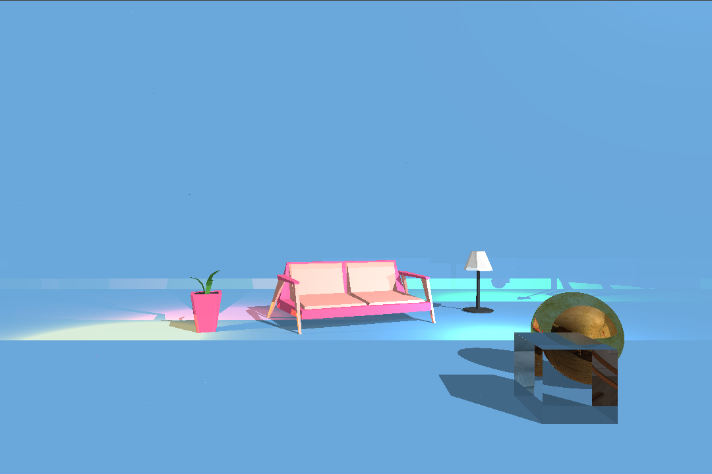

# 🐍 py-tracer 🖼️ Proyecto 2: Ray Tracer

Ray tracer using python and PyGame as main library.

## 📇 Index

- [🚀 How to use it?](#🚀-how-to-use-it)
    - [👟 Run it](#👟-run-it)
    - [📄 Documentation](#📄-documentation)
    - [✅ Tips](#✅-tips)
- [🎭 Show off](#🎭-show-off)
- [🫠 Who I'm?](#🫠-who-im)

## 🚀 How to use it?

### 👟 Run it

Simply run the next command:

``` bash
python raytracer.py
```

That's all! 🎉 Wait until is done!

### 📄 Documentation

1. This project functions by reading a scene file located in the [./scenes/](./scenes/) directory.

    - You can modify the file being read by changing the value of the `file_name` variable on line $17$ of the [./raytracer](./raytracer.py) file.

    - You can modify the height and width by changing the value of the `width` and `height` variables on line $23$ & $24$ of the [./raytracer](./raytracer.py) file.

2. Each scene file operates by reading each line and extracting the first parameter of each line to define various configurations, textures, lights, materials, or objects.

3. Next, I will explain how to use the scene files:

    - Name: It refers to the first position in the line and identifies the complete line format.
    - Format: It refers to the parameters after the name. Each parameter needs to be separated by a blank space.
    - Type: It refers to the type of definition, such as configurations, textures, lights, materials, or objects.

| Name | Format | Type | Comments |
|-|-|-|-|
| render_using | 'threads' or 'normal' | configuration | It refers to using the threads library or not. |
| batch_size | number | configuration | To be applied it needs to be after *render_using*, if it is not instantiated the gcd of the width and height will be used. |
| use_hex | 'true' or 'false' | configuration | This enable using hex color codes for *material* color. |
| texture | name file_path | texture | |
| ambient | intensity | light | |
| directional | d1 d2 d3 intensity | light | |
| point | x y z intensity r g b | light | |
| material | name (hex or r g b) specular ks material_type texture_name ior | material |material_type types: OPAQUE, REFLECTIVE, TRANSPARENT; texture_name can be None |
| sphere | x y z radius material_name | object | |
| plane | x y z n1 n2 n3 material_name | object | |
| disk | x y z n1 n2 n3 radius material_name | object | |
| AABB | x y z dx dy dz material_name | object | |
| triangle | a1 a2 a3 b1 b2 b3 c1 c2 c3 material_name | object | |
| object | px py pz sx sy sz rx ry rz object_path material_name | object | |

### ✅ Tips

- 🧠 Using **CTRL+R** you can update the scene based on the scene file.
- 🧠 USing **CTRL+S** you can take screenshots.

## 🎭 Show off

| Final Scene | Inspiration |
|-|-|
|  |  |

The final scene file is [./scenes/final.txt](./scenes/final.txt)

## 🫠 Who I'm?

Samuel A. Chamalé - 21881
