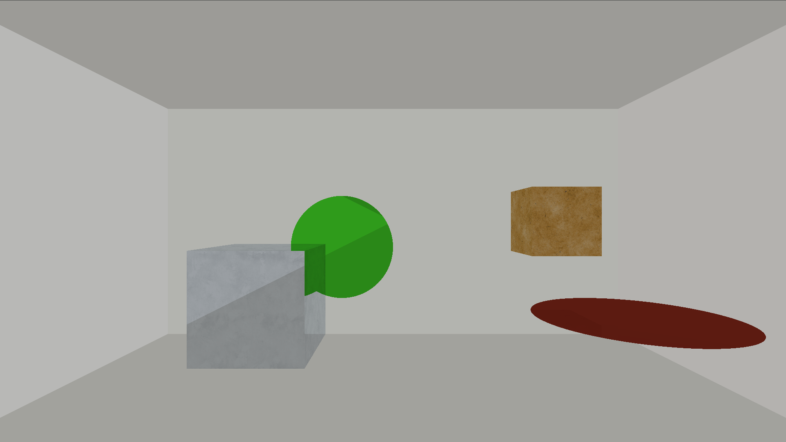

# 🐍 py-tracer 🖼️ RT3: Planes, Disks and Cubes

Ray tracer using python and PyGame as main library.

## 🚀 How to execute it?

Simply run the next commands:

``` bash
python raytracer.py
```

That's all! 🎉 Wait unit it finish the render.

### ✅ Tips

- ℹ️ You can modify the scene using the [./assets/scenes/444.txt](./assets/scenes/444.txt) or by creating a new scene file and defining it on the program.
- 🧠 With **CTRL+R** you can update the scene based on the scene file.
- 🧠 With **CTRL+S** you can take screenshots.

## 🎭 Show off



## 🫠 Who I'm?

Samuel A. Chamalé - 21881
